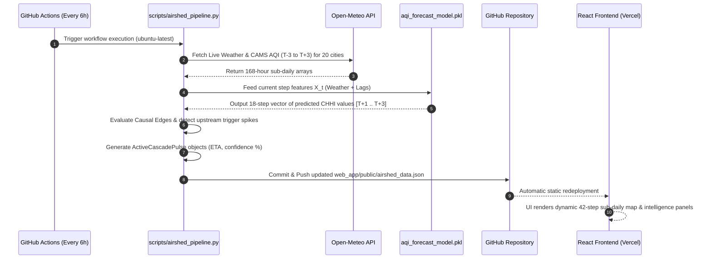

```mermaid
sequenceDiagram
    autonumber
    participant Cron as GitHub Actions (Every 6h)
    participant Pipe as scripts/airshed_pipeline.py
    participant API as Open-Meteo API
    participant Model as aqi_forecast_model.pkl
    participant Repo as GitHub Repository
    participant App as React Frontend (Vercel)

    Cron->>Pipe: Trigger workflow execution (ubuntu-latest)
    Pipe->>API: Fetch Live Weather & CAMS AQI (T-3 to T+3) for 20 cities
    API-->>Pipe: Return 168-hour sub-daily arrays
    Pipe->>Model: Feed current step features X_t (Weather + Lags)
    Model-->>Pipe: Output 18-step vector of predicted CHHI values [T+1 .. T+3]
    Pipe->>Pipe: Evaluate Causal Edges & detect upstream trigger spikes
    Pipe->>Pipe: Generate ActiveCascadePulse objects (ETA, confidence %)
    Pipe->>Repo: Commit & Push updated web_app/public/airshed_data.json
    Repo-->>App: Automatic static redeployment
    App-->>App: UI renders dynamic 42-step sub-daily map & intelligence panels

```